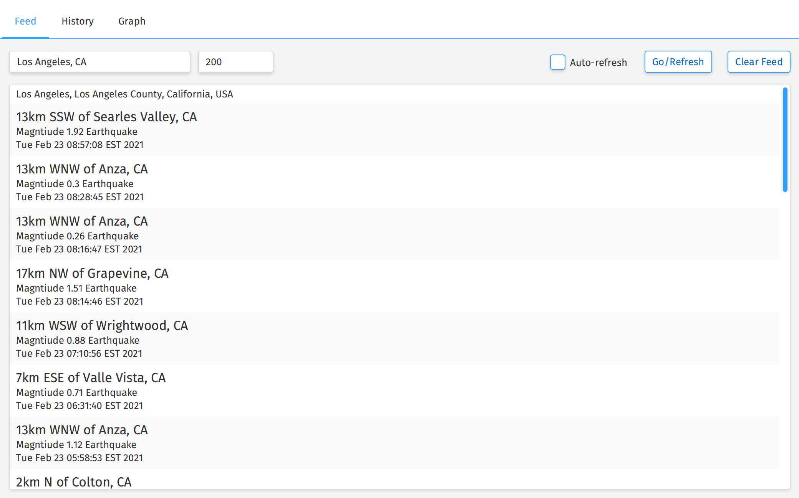
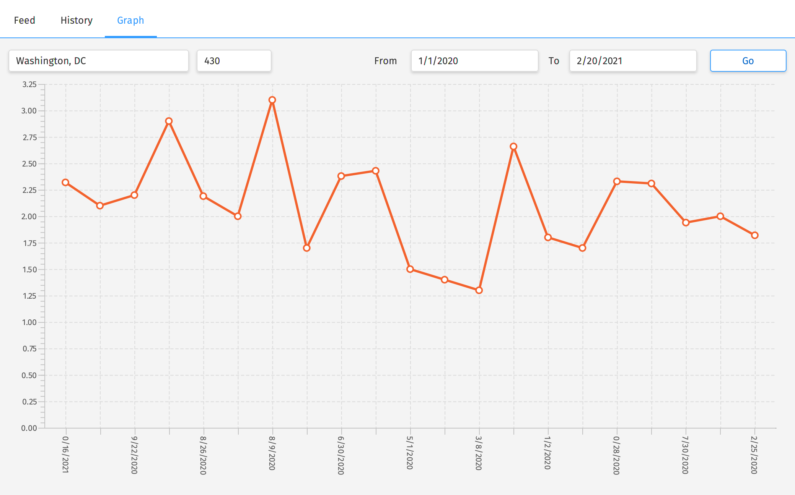

# EarthquakeApp

JavaFX application to display and track earthquakes. This was a project for my Radford Principles of CS 3 class.

This utilizes the USGS web API to pull earthquake data, as well as the LocationIQ API to translate entered search results into addresses and latitude/longitude.

### Build

This Java project was built with the IntelliJ IDE but all that is needed to build/run the java files is `javac` - simply compile the `.java` files and then run `Main`.

### Screenshots

